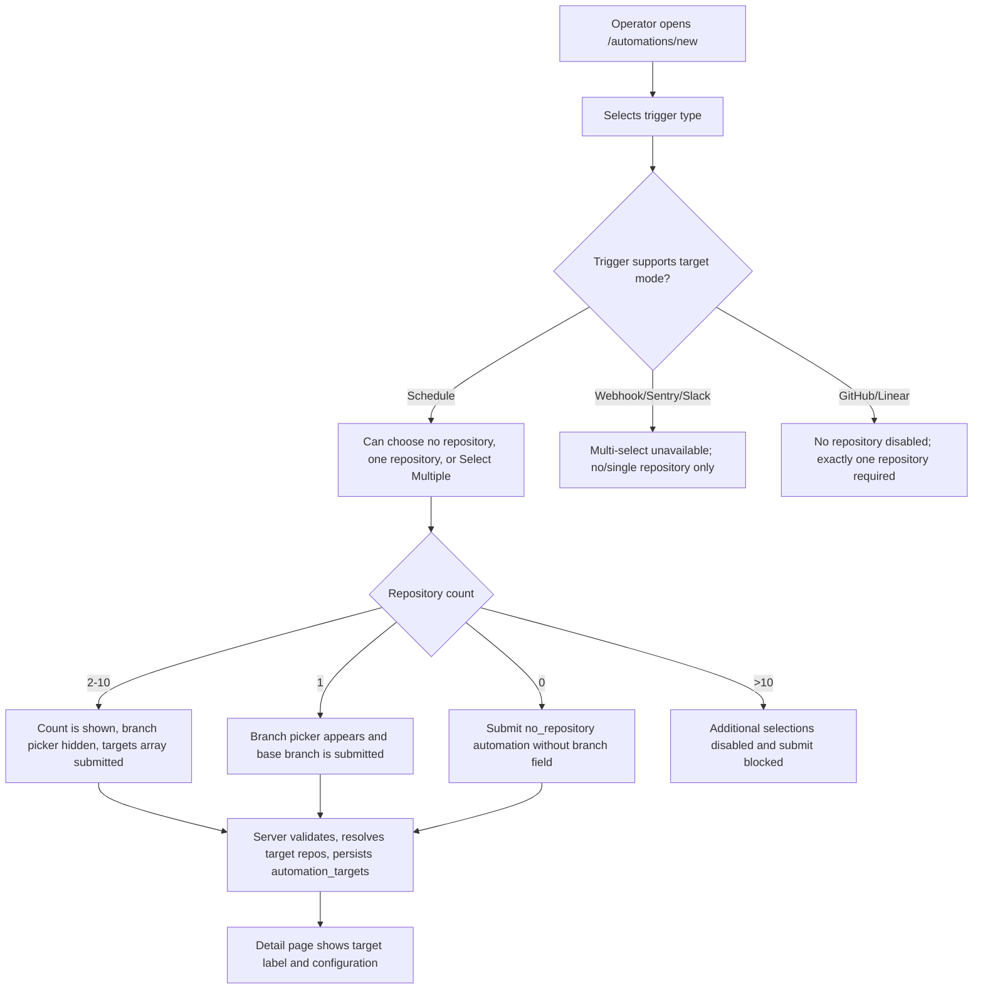
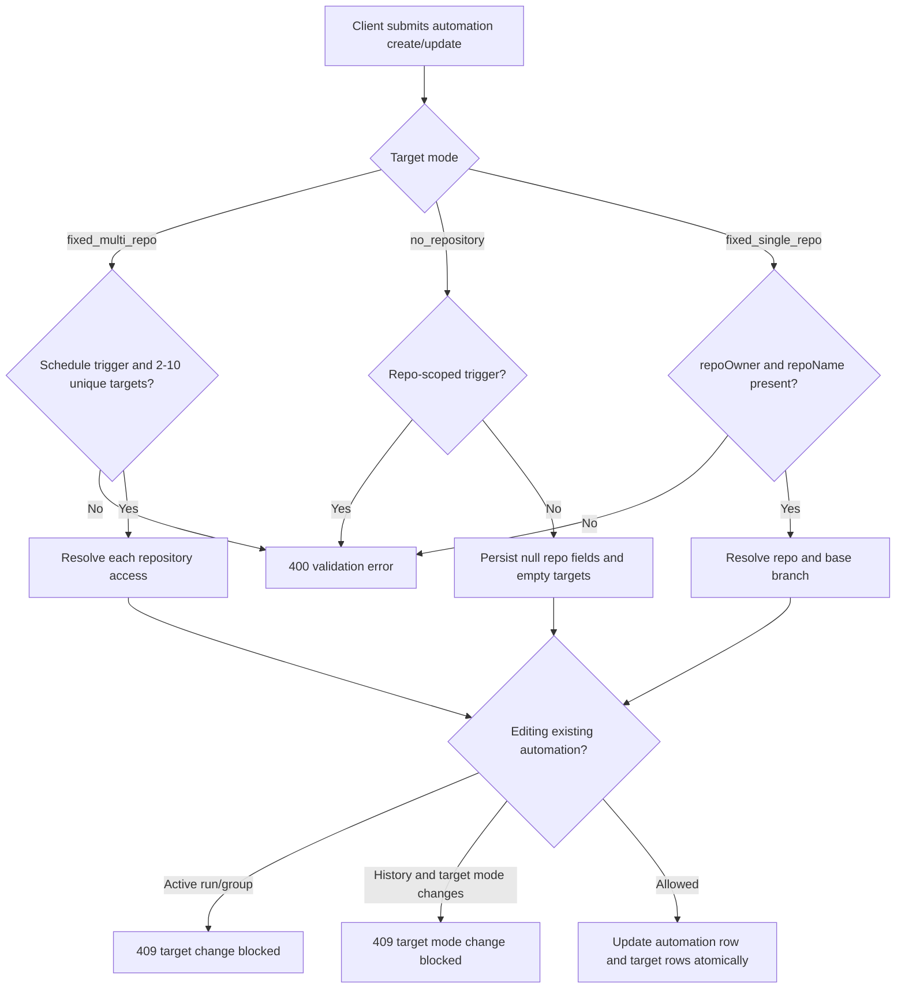
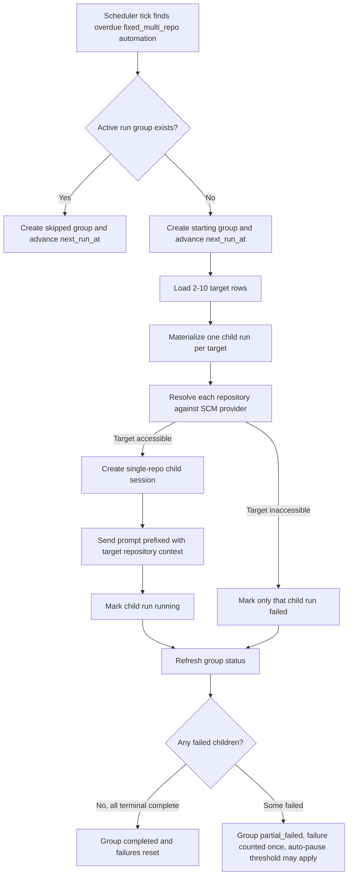
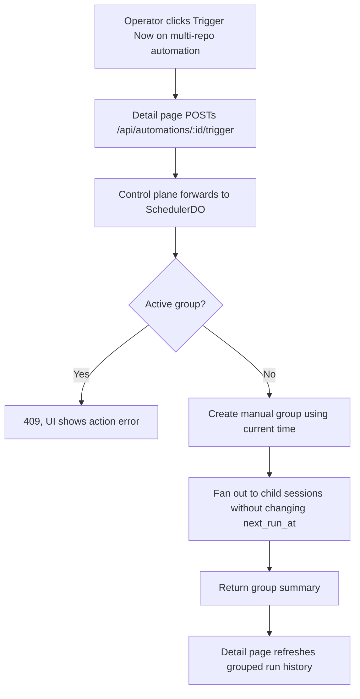
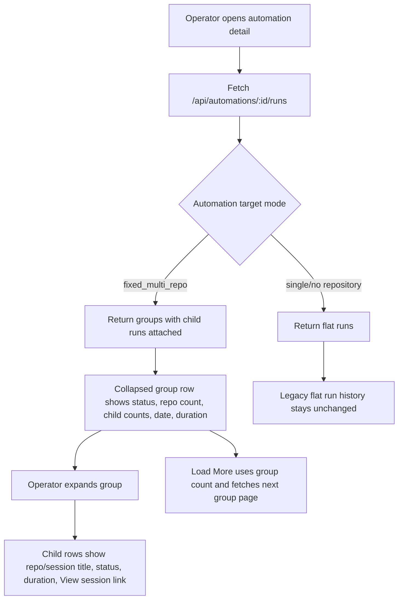
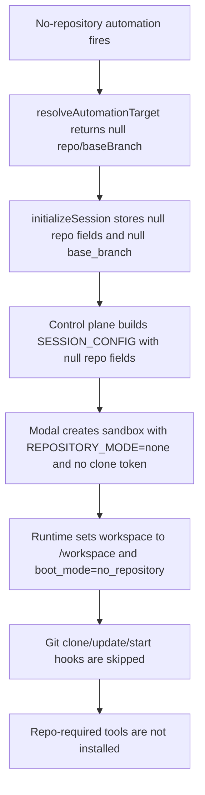
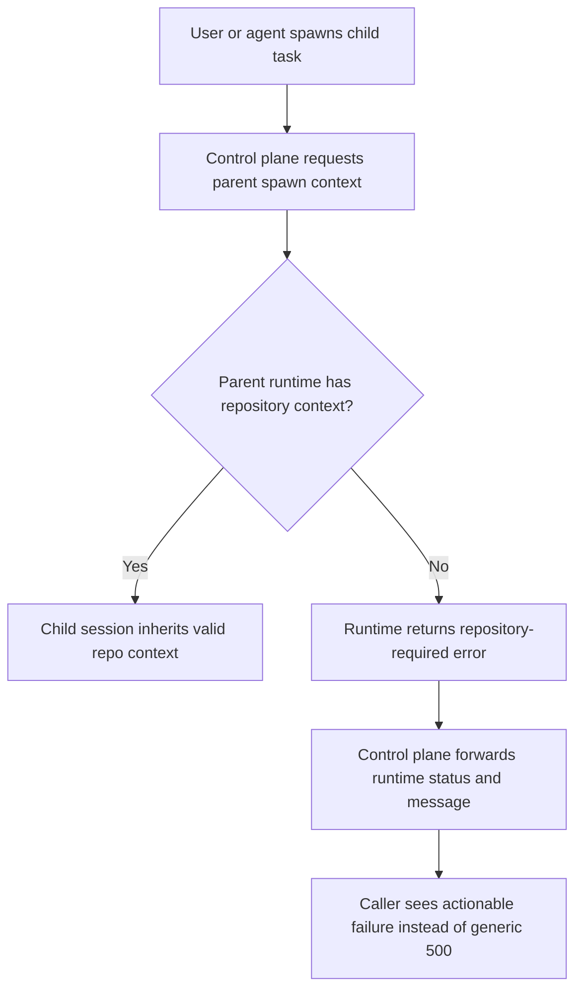
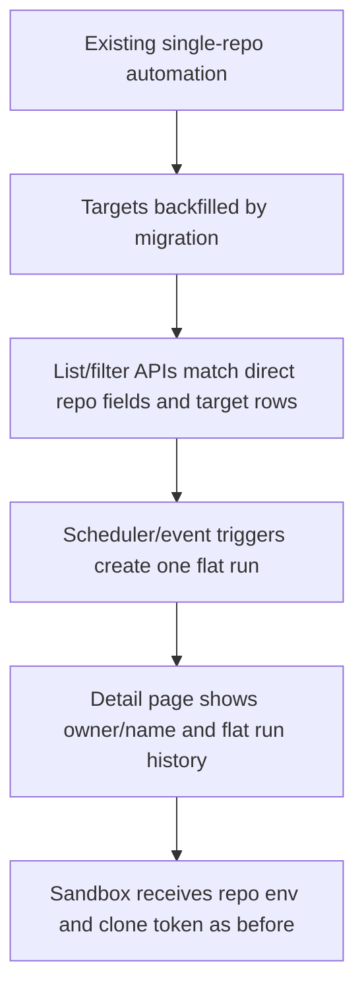

# Dogfood Report - feat/multi-repo-automations

> Diff-scoped browser QA of `feat/multi-repo-automations` vs `main`. Generated by `/ce-dogfood-beta`
> on 2026-06-28.

## Diff Summary

- Adds `fixed_multi_repo` automation targets alongside `fixed_single_repo` and `no_repository`, with
  normalized `automation_targets` storage and grouped run records.
- Updates automation create/edit validation so scheduled/manual automations can fan out to 2-10
  repositories, while repo-scoped triggers still require exactly one repository.
- Adds scheduler fan-out: one run group per multi-repo firing, one child session/run per target
  repository, partial-failure tracking, active-group concurrency protection, recovery handling, and
  failure auto-pause accounting.
- Updates web automation forms and detail pages to select no/single/multiple repositories, hide
  branch selection for multi-repo targets, show grouped run history, and paginate group rows.
- Extends session, sandbox, Modal, and sandbox-runtime handling so no-repository automations can
  start without clone metadata while repo-required tools remain gated.
- Adds migrations `0029` through `0033`, control-plane integration coverage, web component tests,
  Modal tests, and sandbox-runtime tests for the new target modes.

## Personas

Source: inferred from `docs/AUTOMATIONS.md`, `docs/MULTI_REPO_AUTOMATIONS.md`, and the branch diff.

- **Automation operator** - creates recurring maintenance automations and cares that target
  selection is clear, bounded, and sends work to the expected repositories.
- **Repository maintainer** - receives per-repository sessions and pull requests; cares that each
  child run uses the correct repository/default branch and that failures do not block unrelated
  repositories.
- **Platform administrator** - monitors reliability and cost; cares about grouped history, partial
  failures, auto-pause behavior, recovery, and no-repository sandbox safety.

## Flows Tested

### Flow 1: Create Or Edit Automation Targets

### Flow 2: Target Validation And Editing Guards

### Flow 3: Scheduled Multi-Repo Fan-Out

### Flow 4: Manual Multi-Repo Run

### Flow 5: Grouped Run History

### Flow 6: No-Repository Automation Session And Sandbox

### Flow 7: Child Session Boundary

### Flow 8: Legacy Single-Repo Regression

## Test Matrix & Results

| #   | Flow                   | Journey / Scenario                                                                                                                                                                     | Status | Issue                                                                                                                                                                                                                    | Fix                                                                                    | Commit  |
| --- | ---------------------- | -------------------------------------------------------------------------------------------------------------------------------------------------------------------------------------- | ------ | ------------------------------------------------------------------------------------------------------------------------------------------------------------------------------------------------------------------------ | -------------------------------------------------------------------------------------- | ------- |
| 1   | Create/edit targets    | Web form renders schedule target picker; no-repository, single-repo, and multi-repo modes are visible and branch field appears only for single repo.                                   | Pass   | -                                                                                                                                                                                                                        | -                                                                                      | -       |
| 2   | Create/edit targets    | Multi-select search, count, 10-repo cap, no-repository option, and switch back to single selection behave correctly.                                                                   | Fixed  | Repository search stayed filtered after closing/reopening the picker.                                                                                                                                                    | Clear `repoQuery` when the repository popover closes.                                  | 48420eb |
| 3   | Create/edit targets    | Non-schedule triggers collapse/disallow multi-repo, while GitHub/Linear require exactly one repository.                                                                                | Pass   | -                                                                                                                                                                                                                        | -                                                                                      | -       |
| 4   | Create/edit targets    | Automation detail page labels multi-repo as repository count, no-repo as "No repository", and single-repo as owner/name plus branch.                                                   | Pass   | -                                                                                                                                                                                                                        | -                                                                                      | -       |
| 5   | Target validation      | Create fixed_multi_repo schedule with 2-10 targets persists rows and returns null direct repo fields plus populated targets.                                                           | Pass   | -                                                                                                                                                                                                                        | -                                                                                      | -       |
| 6   | Target validation      | Reject duplicate targets, one-target multi-repo, over-10 targets, missing target fields, and multi-repo non-schedule triggers.                                                         | Pass   | -                                                                                                                                                                                                                        | -                                                                                      | -       |
| 7   | Target validation      | Create no_repository schedule/webhook succeeds, while no_repository GitHub/Linear triggers are rejected.                                                                               | Pass   | -                                                                                                                                                                                                                        | -                                                                                      | -       |
| 8   | Target validation      | Update target rows atomically; active run/group blocks target edits; target mode changes after history are rejected.                                                                   | Pass   | -                                                                                                                                                                                                                        | -                                                                                      | -       |
| 9   | Scheduled fan-out      | Overdue fixed_multi_repo schedule creates one group, materializes one child run per target, resolves repo defaults, advances next_run_at once, and counts as one processed automation. | Pass   | -                                                                                                                                                                                                                        | -                                                                                      | -       |
| 10  | Scheduled fan-out      | One inaccessible target fails only its child, siblings continue, group becomes partial_failed, and failure accounting/auto-pause are correct.                                          | Pass   | -                                                                                                                                                                                                                        | -                                                                                      | -       |
| 11  | Scheduled fan-out      | Active group causes a skipped scheduled group without failure counting or duplicate children.                                                                                          | Pass   | -                                                                                                                                                                                                                        | -                                                                                      | -       |
| 12  | Manual run             | Trigger Now on multi-repo creates a group, starts child runs, returns group JSON, and does not move next_run_at.                                                                       | Pass   | -                                                                                                                                                                                                                        | -                                                                                      | -       |
| 13  | Manual run             | Trigger Now while an active group exists returns 409 and the detail page shows an action error.                                                                                        | Pass   | -                                                                                                                                                                                                                        | -                                                                                      | -       |
| 14  | Grouped history        | Run completion updates child status, derives group completed/partial_failed/failed, resets or increments consecutive failures exactly once.                                            | Pass   | -                                                                                                                                                                                                                        | -                                                                                      | -       |
| 15  | Grouped history        | Run list API returns groups with attached children and paginates by group rows.                                                                                                        | Pass   | -                                                                                                                                                                                                                        | -                                                                                      | -       |
| 16  | Grouped history        | Web RunHistory displays collapsed group counts, expands child rows, shows failure/skip reasons, session links, durations, and load-more text.                                          | Fixed  | Expanded failed/skipped child rows did not show their reason text.                                                                                                                                                       | Render child failure/skip reasons under expanded group rows.                           | 48420eb |
| 17  | No-repository sandbox  | No-repo automation initialization stores null repo/baseBranch and passes null repo config to sandbox env.                                                                              | Pass   | -                                                                                                                                                                                                                        | -                                                                                      | -       |
| 18  | No-repository sandbox  | Modal/sandbox-runtime starts no-repo sandboxes without clone tokens, skips clone/update/start hooks, and omits repo-required tools.                                                    | Pass   | -                                                                                                                                                                                                                        | -                                                                                      | -       |
| 19  | Child session boundary | No-repo parent child-spawn failure forwards the runtime error/status instead of masking it as a generic 500.                                                                           | Pass   | -                                                                                                                                                                                                                        | -                                                                                      | -       |
| 20  | Legacy regression      | Existing single-repo automations still create flat runs, display flat history, resolve repo settings, and match repo filters.                                                          | Pass   | -                                                                                                                                                                                                                        | -                                                                                      | -       |
| 21  | Migrations             | D1 migrations `0029` through `0033` apply cleanly and preserve/backfill existing automation/session/run data.                                                                          | Pass   | -                                                                                                                                                                                                                        | -                                                                                      | -       |
| 22  | Cross-cutting          | Typecheck, lint, build, unit tests, integration tests, Python tests, and browser console checks are clean.                                                                             | Pass   | Root lint scans generated `.open-next` artifacts; root typecheck also fails in local `opencomputer-infra` because `@opencomputer/sdk/node` is absent. Scoped package checks for changed and dependent workspaces passed. | Used source-scoped lint/typecheck/test/build commands plus full workspace build/tests. | -       |

## What Was Fixed

### Repository picker search persists after close - `48420eb`

- **Symptom:** After filtering the repository picker and closing it, reopening the picker kept the
  stale search query. In browser dogfood, the picker reopened filtered to `gamma` while the selected
  `acme/alpha` repository was hidden.
- **Root cause:** `repoQuery` was only controlled by the search input and was never reset when the
  popover closed.
- **Fix:** Reset `repoQuery` when `repoDropdownOpen` becomes false in
  `packages/web/src/components/automations/automation-form.tsx`.
- **Regression test:** `packages/web/src/components/automations/automation-form.test.tsx` verifies
  that closing and reopening the picker clears the search and restores the full repository list.

### Expanded group child failures hide the reason - `48420eb`

- **Symptom:** The grouped run history showed a failed child row, but not the child `failureReason`,
  so an operator could not see why that repository failed from the expanded group.
- **Root cause:** `RunHistory` rendered failure/skip reason text for flat runs and group-level
  reasons, but not for child runs inside a group.
- **Fix:** Render child `failureReason` / `skipReason` beneath expanded grouped child rows in
  `packages/web/src/components/automations/run-history.tsx`.
- **Regression test:** `packages/web/src/components/automations/run-history.test.tsx` verifies child
  failure and skip reasons appear after expanding a group.

## Console Errors

None observed in the dogfood browser session. Console output was limited to React DevTools, HMR, and
Fast Refresh development messages.

## Human Verifications

The browser pass used a local NextAuth JWT and `agent-browser` network mocks for `/api/repos`,
branch listing, automation detail, and grouped runs because the local control plane on
`http://localhost:8787` was not running.

External OAuth, real GitHub repository access, Slack delivery, and live Modal sandbox creation were
not manually exercised. They are covered here by unit/integration tests and remain candidates for
manual verification before production rollout.

## Decisions for a Human

None.

## Learnings

- `agent-browser network route` should be ordered from most-specific to least-specific routes; a
  broad `/api/automations/:id` mock can catch `/runs` requests.
- Multi-repo partial failures need child-level reason text in the UI, not only aggregate status
  counts, otherwise operators cannot act on the failed repository.
- Repository picker search state should reset at popover boundaries. Persisting a prior query makes
  target edits look like repositories disappeared.

## Final Status

Ready with caveats. The branch passed source-scoped lint/typecheck/build/test coverage,
control-plane workerd/D1 integration tests, Modal and sandbox-runtime Python tests, and
authenticated browser dogfood of the changed automation form and grouped history UI using mocked
local API responses. The remaining caveat is live external verification: OAuth, real GitHub App
repository access, Slack delivery, and live Modal sandbox creation were not driven end-to-end in
this local run.

Verification summary:

- `npm run build -w @open-inspect/shared`
- `npm run lint/typecheck/test -w @open-inspect/shared`
- `npm run lint/typecheck/test -w @open-inspect/control-plane`
- `npm run test:integration -w @open-inspect/control-plane` (first run hit a Vitest workerd teardown
  race after all tests passed; rerun passed cleanly)
- `npm run lint/typecheck/test/build -w @open-inspect/web`
- `npm test` across TypeScript workspaces
- `npm run build` across workspaces
- `npm run lint/typecheck/test` for `github-bot`, `slack-bot`, and `linear-bot`
- `uv run --extra dev pytest tests/ -v` in `packages/modal-infra`
- `uv run --extra dev pytest tests/ -v` in `packages/sandbox-runtime`
- `uv run --extra dev ruff check .` in `packages/modal-infra`
- `uv run --extra dev ruff check .` in `packages/sandbox-runtime`
- `agent-browser` authenticated browser pass on `http://localhost:3000/automations/new` and mocked
  `http://localhost:3000/automations/test-multi`
